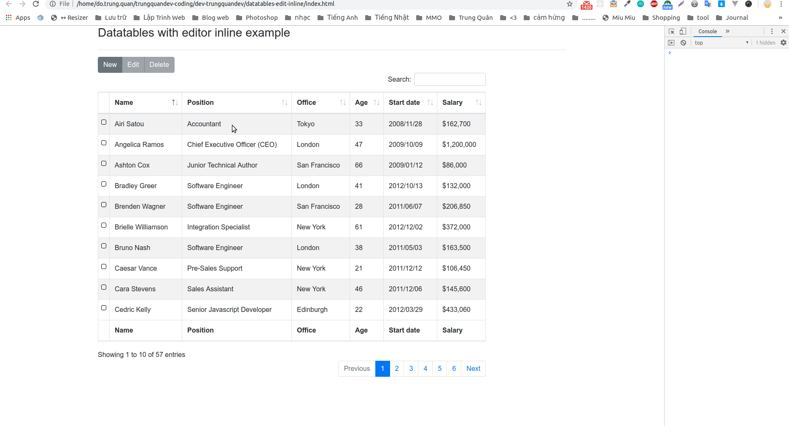

# Datatables with editor inline example

Clone project and run project.

```
$ git clone https://git_url_clone <project_dir>
$ cd <project_dir>
$ npm install
Run file index.html immediately on your browser
```
Demo:



Author: Trung Quân

Blog: https://trungquandev.com/

CV: https://cv.trungquandev.com/

"A little bit of fragrance always clings to the hands that gives you roses!"

Thanks for watching!
